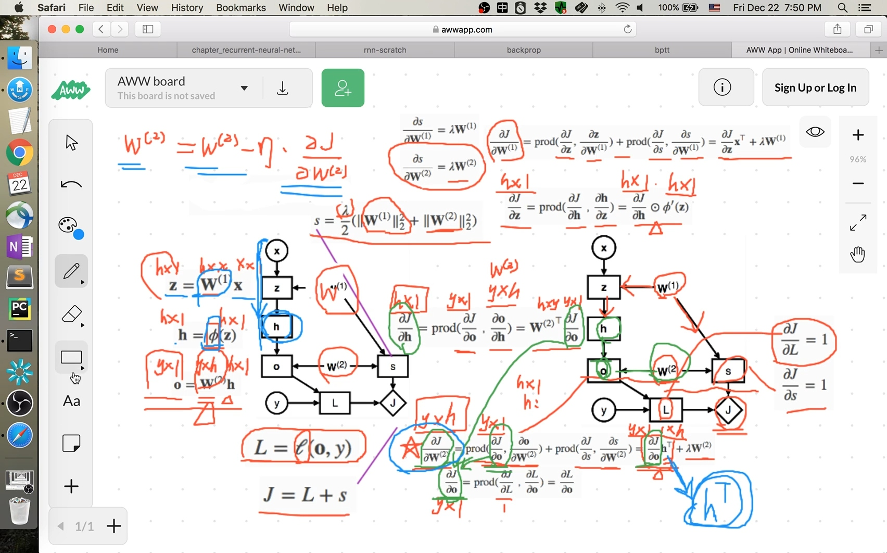
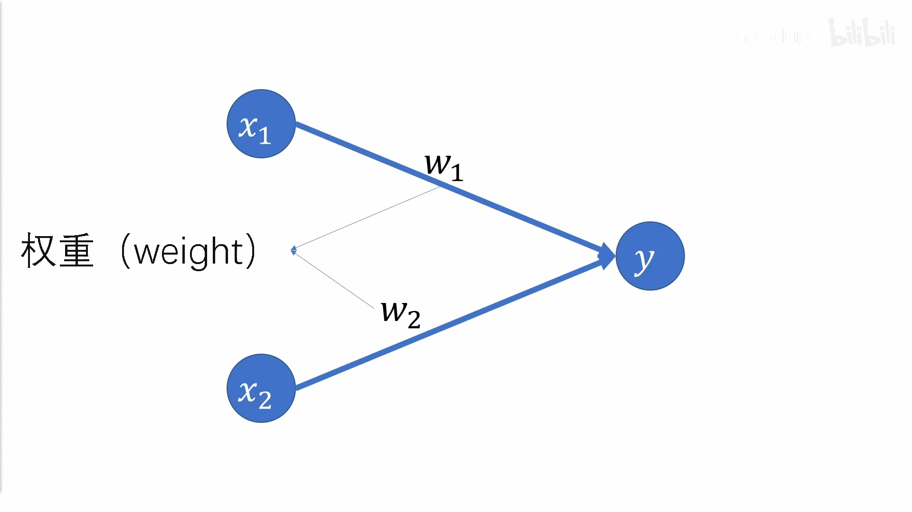
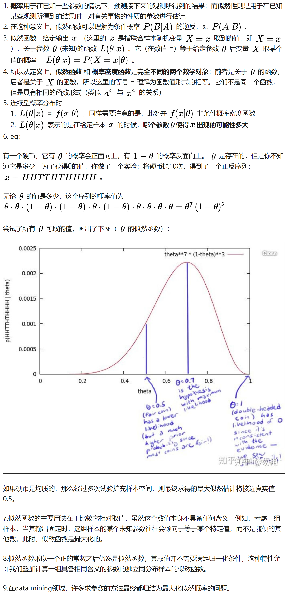
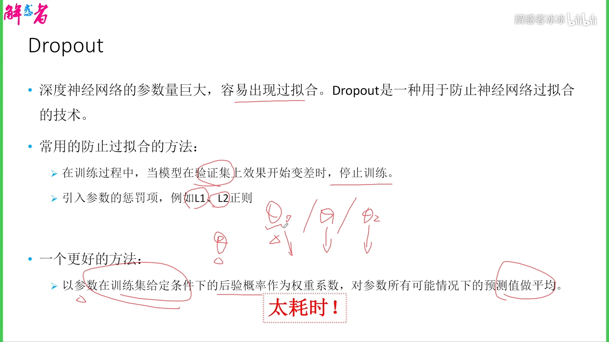
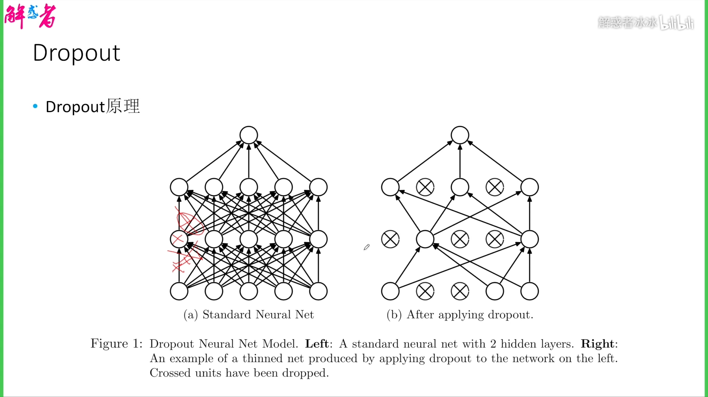
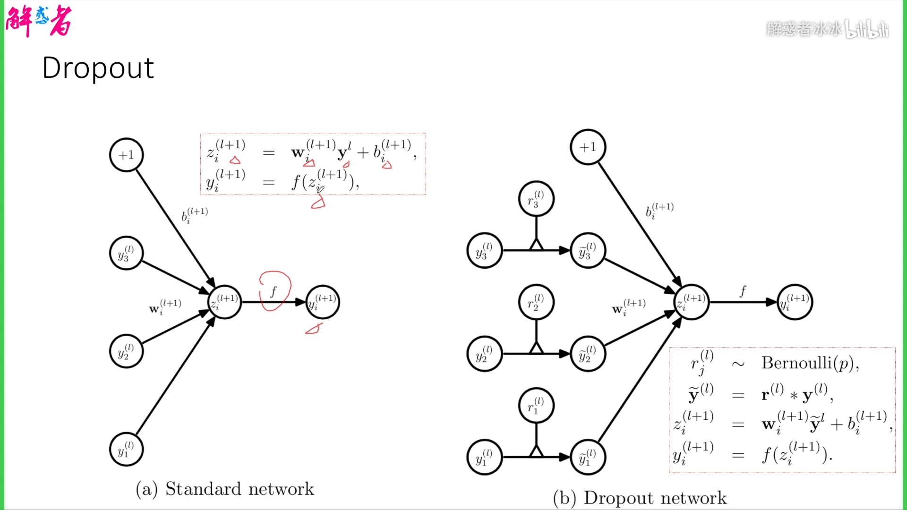
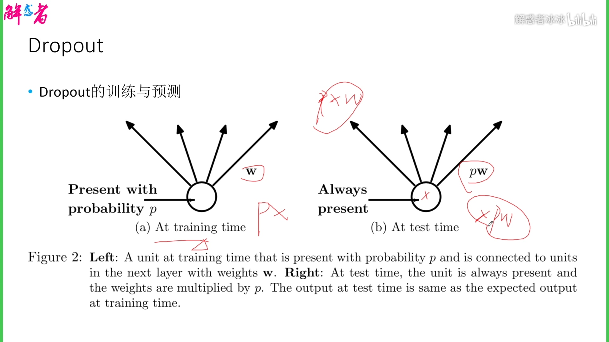

# 基础知识

## 参考资料

- [小猿取经](https://www.cnblogs.com/xiaoyuanqujing/p/11638188.html)
- [刘建平博客](https://www.cnblogs.com/pinard/category/894692.html)
- [李宏毅视频深度学习](https://www.bilibili.com/video/BV1JE411g7XF)
- [李沐动手学深度学习](https://space.bilibili.com/209599371/video)
- [OpenCV计算机视觉实战](https://www.bilibili.com/video/BV1ct411F7Te?p=2)

## 贝叶斯公式

> 可表相关性，不表因果，贝叶斯公式就是当已知结果，问导致这个结果的第i原因的可能性是多少，执果索因，用于计算逆概率

$P(A\cap{B})=P(B|A)P(A)=P(A|B)P(B)$
> 前面为条件概率公式，后面为普通贝叶斯公式，。注意$P(A\cap{B})和P(B|A)、P(A|B)$的含义是不同的,$P(A\cap{B})$的样本是整体的，是全局的；而$P(B|A)$的样本是$P(A)$中的，$P(A|B)$的样本是$P(B)$中的，都是局部的

全概率公式
$P(A)=\sum_{i=1}^nP(A\cap{B})=\sum_{i=1}^nP(A|B_i)P(B_i)$
>全概率公式的意义在于，当某一事件的概率难以求得时，可转化为在一系列条件下发生概率的和。

结合上面两个公式可得：
$P(B_i|A)=\frac{P(A|B_i)P(B_i)}{\sum_{j=1}^n{P(A|B_j)P(B_j)}}$

## 独热编码 one hot encoding

独热编码即 One-Hot 编码，又称一位有效编码，其方法是使用N位状态寄存器来对N个状态进行编码，每个状态都由他独立的寄存器位，并且在任意时候，其中只有一位有效。

例如：

自然状态码为：000,001,010,011,100,101
独热编码为：000001,000010,000100,001000,010000,100000

## Soft-Max

将logist的值转化为概率，设$a_i$={1,2,3}，则Soft-Max为$y=\frac{e^{a_i}}{\sum{e^{a_i}}}$={0.09,0.244,0.665}

## 交叉熵 Cross Entropy

> 熵：混乱程度，熵越小越不混乱，熵为0表示一件确定的事情，表示两个值是完全相同的，熵越大表示两个值差距越大

用于计算两个值之间的距离，然后可以通过这个距离优化模型，即cross entropy充当loss function

$L=-(ylog\hat{y}+(1-y)log(1-\hat{y}))$

## 正向传播、反向传播

正向传播直接求当前参数(w、b)下函数的的值，反向传播求的是梯度，梯度，即斜率，即偏微分的值
<https://www.bilibili.com/video/BV1dW41187vW>
  

## 感知机

感知机接受多个输入信号，输出一个信号(多元一次函数)
$x_1,x_2$为节点/神经元

感知机可以模拟常用的逻辑电路，其中参数$w_1,w_2$需要人手工调整，让机器根据需求调整$w_1,w_2$的过程称为机器学习

## 似然函数

  

## 机器学习算法优化

<https://blog.csdn.net/u012328159/article/details/80311892>
大致两类：
- 训练速度优化/收敛优化
> 优化的是学习率
- 过拟合/欠拟合优化
> 优化的是模型或者参数

## dropout

用于解决过拟合问题，主要思想是去掉一些神经元，相当于抽样训练，一种说法是减少多层神经元的耦合性，让每层神经元更好的抽象
  
  
  
  
