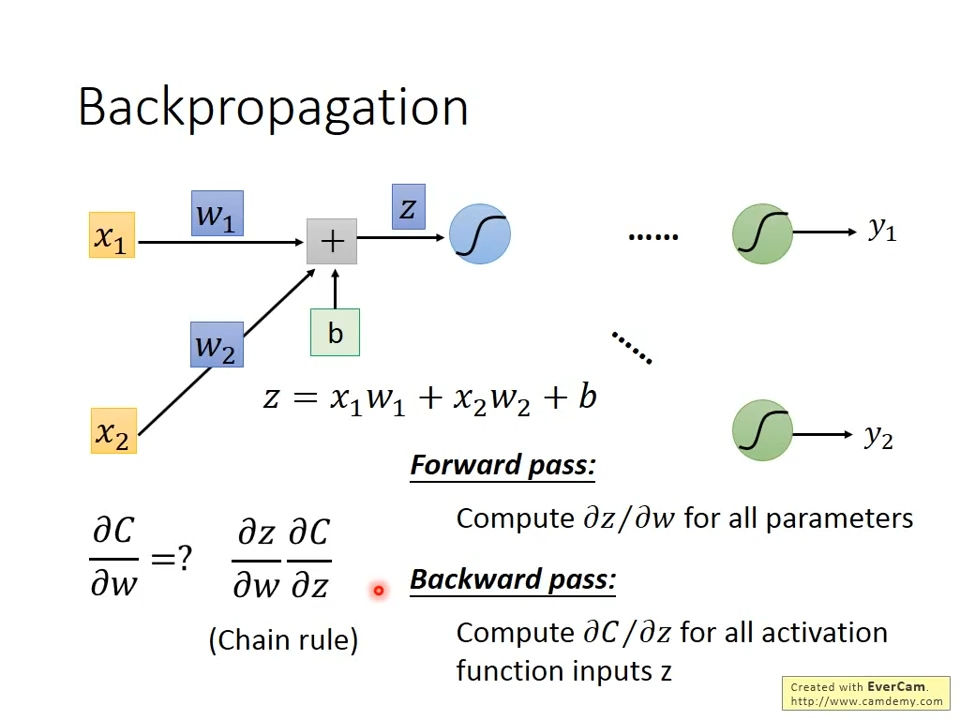

# P12-P17

## P12 Brief Introduction of Deep Learning

计算过程和线性回归一样，三部曲

1. 选择模型
2. 找到损失函数
3. 通过求损失函数最小值更新参数

## P13 BackPropagation

### 链式法则(chain rule)

  

### Cost function（y target于y hat的距离）

  

### Forward pass 微分值即是前面输入的特征

  
  

### Backward pass 微分值为后面一层微分值的和，倒过来看就是等于前面一层的微分值的和

*最后一层微分值如何计算？
  

## P14 Tips for Training DNN

优化方法也和线性回归部分类似

1. 使用不同激活函数，如ReLU,Maxout(ReLU为Maxout的一种特殊情况，Maxout可自学习激活函数)

2. Adam=RMSProp(学习率除以gradient的均方根，类似Adagrad)+Momentum(叠加前面计算过的gradient)
3. Regularization（L1/L2）
4. Dropout，训练时减少一些Neuron，测试时使用全部Neuron
  

## P15 Why Deep Learning

Modularization（复用，高效率）

## P16 PyTorch 基础教程

计算图：将所有公式计算转为一个图计算，通过链式法则方便计算各个地方的微分
标量(scalar)、向量(vector)、矩阵(matrix)、张量(tensor)

<https://colab.research.google.com/drive/1Xed5YSpLsLfkn66OhhyNzr05VE89enng#scrollTo=vuigjBAiMThv>

## P17 CNN(Convolutional Neural Network，卷积神经网络)

> 适合用于图像处理，原理是去除无用特征（即降低复杂度，降噪，去除杂质，让程序专注于感兴趣的部位），同时对数据进行抽象，让程序拥有大局观

架构
  

卷积核计算转化为NN
  

Max Pooling
  
  

实战
  

应用：

1. deep dream（生成图像）
2. deep style（图像风格合并）
3. 其他(都是类图像的模式)：围棋、语音识别、文字处理

## P18-P19 GNN(Graph Neural Network)

P18：迷迷糊糊  
*P19：暂时跳过

## P20 RNN(Recurrent Neural Network，卷积神经网络)

> 让程序拥有记忆能力
LSTM(Long short term memory)是其中一种比较常用的实现

P22 Word Embedding

通过某种编码手段，让程序能识别句子中的词与词之间的关系，也就是让程序自动将每个单词进行归类，最终目的是让程序理解文章或人类语言

主流的两种做法：

1. 计算两个词同时在某个地方出现的次数
2. 计算某个词前后左右会接另外一个词的概率

> 为什么能生效，原因可能是如果a和b后面接c的概率相似，那么a和b属于同一类词的可能性也会比较大
