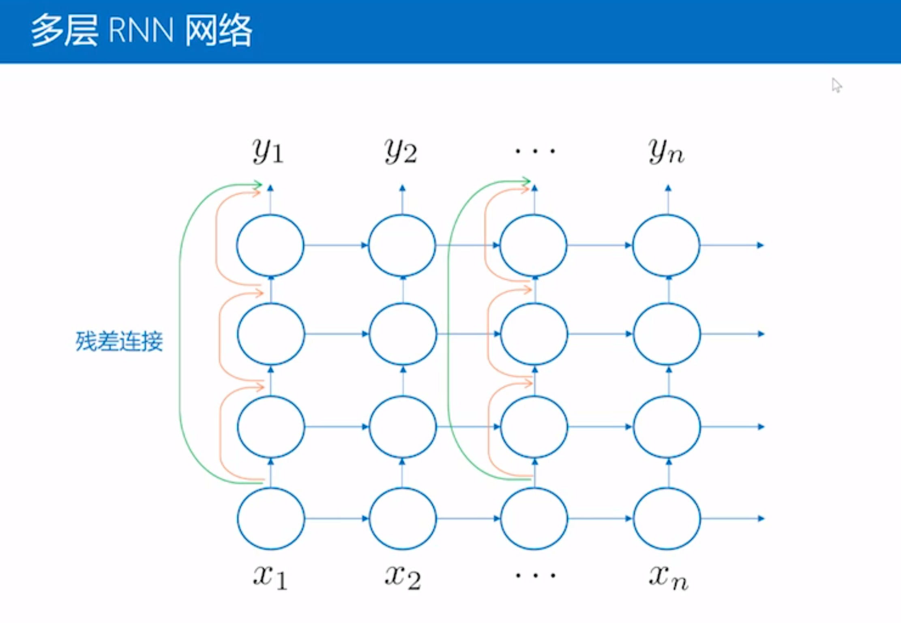

# P20 RNN(Recurrent Neural Network，循环神经网络)

  

## 语言模型

  

## 梯度消失(Gradient Vanishing)和梯度爆炸(Gradient Exploding)

  

当序列很长的时候，不凑巧所有微分值很小或很大的时候，会出现梯度消失(值为0)和梯度爆炸问题(值为无穷大)，可用gradient clipping解决

## 长短期记忆LSTM(Long short term memory)

是其中一种比较常用RNN的变种，让程序拥有记忆能力
可解决梯度消失和梯度爆炸问题
  
输入门、遗忘门、输出门、候选细胞、记忆细胞
  

其他简化版：
  
  
  
  

## 门控循环单元GRU(Gated Recurrent Unit)

  

重置门、更新门、候选隐含状态
  
