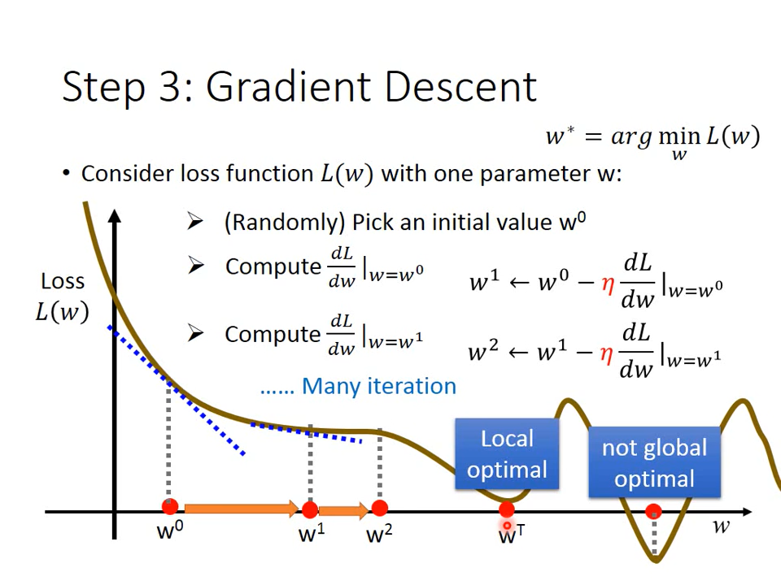
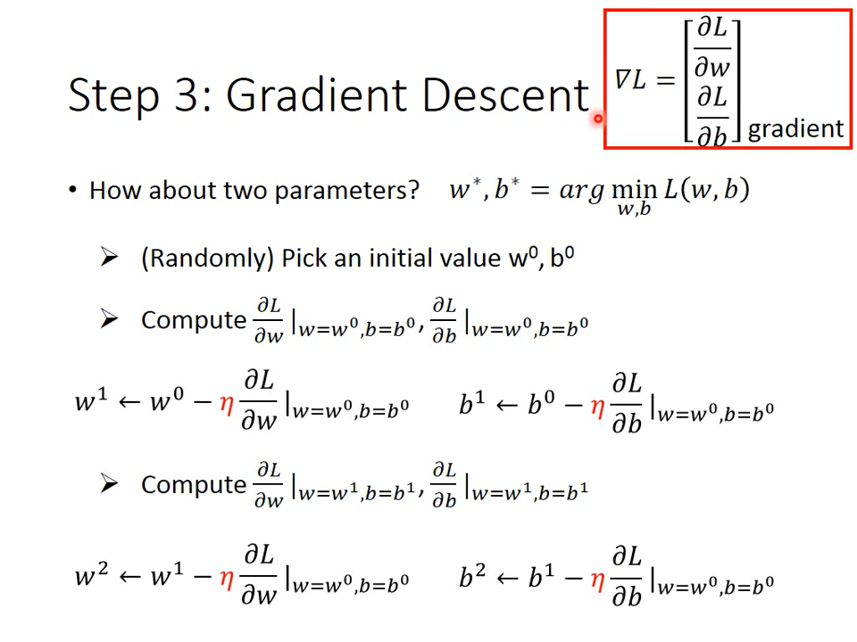
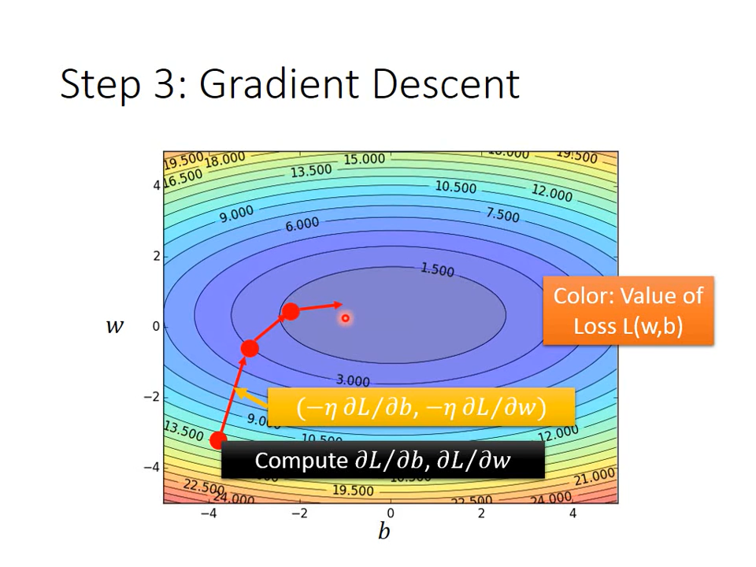
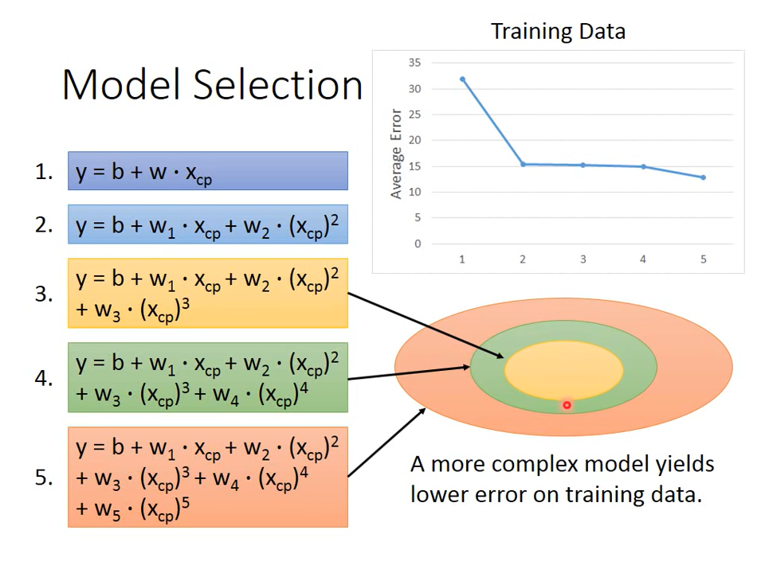
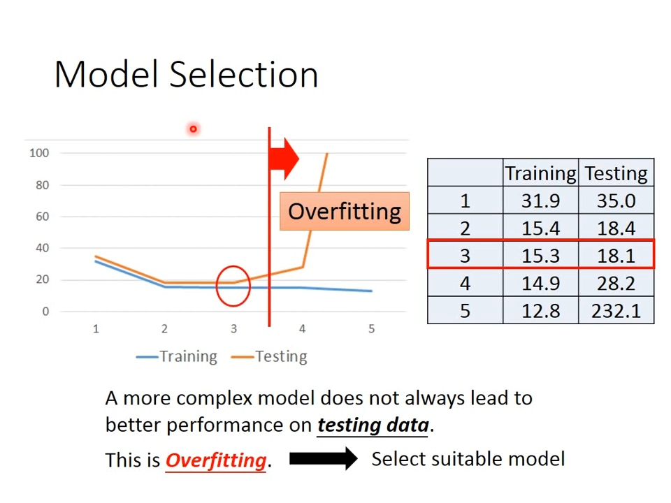
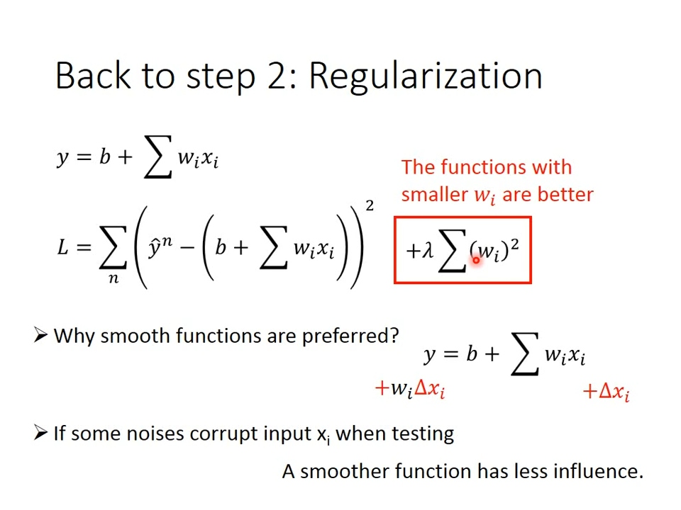

# Regression

- [Regression](#regression)
  - [线性回归步骤](#线性回归步骤)
    - [1 线性回归公式](#1-线性回归公式)
    - [2 损失函数](#2-损失函数)
    - [3 梯度下降](#3-梯度下降)
    - [4 过拟合](#4-过拟合)
    - [5 正则化](#5-正则化)

机器学习：让机器找出一个解决问题的函数
比如这样的函数：

- 输入昨天的天气，输出今天的天气
- 输入路况，输出油门和方向盘的大小

监督学习(Supervised): 需要提供已标签化的数据集(即正确的输入、输出都需要准备好)
强化学习(Reinforcement): 使用某种奖励机制，让机器自己找出理想的答案?
想法： 训练出完股票游戏的程序

## 线性回归步骤

### 1 线性回归公式

> 上标：某一对象
> 下标：某一对象的一个属性

目标是找出w,b参数的值使得输入某一x时，得到的y最准确

### 2 损失函数

通过已知的数据集，也就是y减去，可得损失函数：

当存在w，b使得该损失函数最小时，则w和b为(局部)最优解：

### 3 梯度下降

(不仅仅适用于线性回归，只要函数是可微分的都可以用)

> 导数为瞬时变化率：
> 
> 微分：
> 

  

(?为什么图像是长这样的，猜测：为教学目的这里才使用这样的曲线，通过观察方程式 的方程式可知，它的图像应该是一个类似二次函数的图像，也就是有全局最优解的图像，即局部最优解为全局最优解)

1. 不管参数b，先处理w，得
2. 随机选择一个
3. 更新，启动称作学习率

重复上述步骤3，直到取得最小值
此时b也可以类似这样处理，通过偏微分来更新w和b：
  

w和b组成的图像则如同等高线图：
  

### 4 过拟合

  
  

### 5 正则化

回到第2步骤，调整Loss function为：

该式期望的取值越小越好，其原理是去除无效数据或者干扰数据的影响

  
